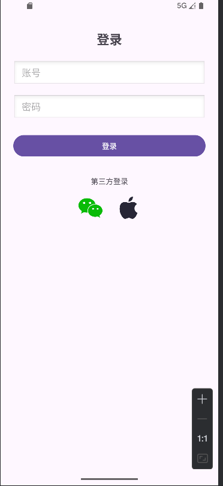
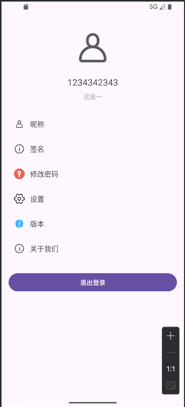

# 移动应用登录与个人中心实战项目（Android）

本项目基于 Android 原生组件完成登录与个人中心页面的前端实现，并按 PRD 要求集成第三方登录入口、客户端本地存储（SQLite 与 SharedPreferences）与基本交互。

## 功能概览
- 登录页面：账号、密码输入，登录按钮，微信/Apple 登录入口（点击提示）。
- 个人中心：圆形头像、用户名与签名展示，信息条目整行可点击并弹出提示。
- 昵称/签名编辑：在个人中心点击对应条目弹出编辑框，保存到 `SharedPreferences` 并即时更新。
- 退出登录：返回登录页并清空任务栈。
- 数据存储：
  - 登录校验使用内置 `SQLiteOpenHelper`，首启预置账号 `1234`/`1234`。
  - 用户信息持久化使用 `SharedPreferences`，包含 `username`（账号名）、`nickname`（可编辑昵称）与 `signature`（可编辑签名）。

## 目录结构（关键）
- `app/src/main/AndroidManifest.xml`：入口 Activity 与主题配置（`LoginActivity` 作为 LAUNCHER）。
- `app/src/main/java/com/example/w1/LoginActivity.kt`：登录逻辑与页面交互，数据库校验与 SP 写入。
- `app/src/main/java/com/example/w1/ProfileActivity.kt`：个人中心展示、编辑昵称/签名与退出逻辑。
- `app/src/main/java/com/example/w1/UserDbHelper.kt`：SQLite 初始化与用户校验。
- `app/src/main/res/layout/activity_login.xml`：登录页布局。
- `app/src/main/res/layout/activity_profile.xml`：个人中心布局。
- `app/src/main/res/values/styles.xml`：圆形头像样式。
- `icon/`：UI 图标素材，已导入到 `res/drawable` 并在页面中使用。

## 环境与技术栈
- 语言与工具：
  - Kotlin `2.0.21`
  - Android Gradle Plugin `8.13.1`
  - Gradle Wrapper（使用仓库内置脚本）
- Android 配置：
  - `compileSdk` 36，`minSdk` 24，`targetSdk` 36
  - 主题与边界使用 AndroidX 与 Material 兼容方案
- 主要依赖：
  - AndroidX Core KTX `1.17.0`
  - AppCompat `1.6.1`
  - Material Components `1.13.0`（`ShapeableImageView` 等）
  - Activity `1.12.1`
  - ConstraintLayout `2.1.4`
- 本地存储：
  - `SQLiteOpenHelper` 用于登录账号校验（预置用户）
  - `SharedPreferences` 用于保存 `username`、`nickname`、`signature`
- 构建要求：
  - 需要 JDK 11 及以上进行构建（JDK 8 会导致插件解析失败）

## 构建与安装
1. 确保 `JAVA_HOME` 指向 JDK 11+，`java -version` 输出为 11 或更高。
2. 在项目根目录执行：
   - 构建 Debug 包：`./gradlew assembleDebug`（Windows 上使用 `.
gradlew.bat assembleDebug`）
3. 安装到设备/模拟器：`adb install -r app/build/outputs/apk/debug/app-debug.apk`
4. 首次启动进入登录页。

## 页面预览

登录页：

个人中心：

## 使用说明
- 默认登录账号：`1234`，密码：`1234`（数据库预置）。
- 登录成功后进入个人中心：顶部展示昵称与签名。
- 编辑昵称/签名：点击对应整行条目，输入后点击“保存”，即时更新并写入 `SharedPreferences`。
- 退出登录：点击“退出登录”返回登录页，并清空返回栈。

## 数据存储设计
- 数据库（SQLite）：
  - 文件名：`app.db`（App 私有目录）。
  - 表结构：`users(id INTEGER PRIMARY KEY AUTOINCREMENT, username TEXT UNIQUE, password TEXT)`。
  - 初始化：首次创建时 `INSERT OR IGNORE INTO users('1234','1234')` 预置示例用户。
  - 校验方法：`UserDbHelper.checkUser(username, password)`。
- SharedPreferences（`user_prefs`）：
  - `username`：账号名（登录时写入）。
  - `nickname`：可编辑昵称（首次登录时若不存在则赋值为 `username`，后续不覆盖）。
  - `signature`：可编辑签名（首次登录时写入默认文案，后续不覆盖）。

## 关键代码定位
- 启动页设置：`app/src/main/AndroidManifest.xml:18`
- 登录校验与 SP 写入：`app/src/main/java/com/example/w1/LoginActivity.kt:31`
- 个人中心读取昵称/签名：`app/src/main/java/com/example/w1/ProfileActivity.kt:29`
- 编辑昵称：`app/src/main/java/com/example/w1/ProfileActivity.kt:35`
- 编辑签名：`app/src/main/java/com/example/w1/ProfileActivity.kt:51`
- 退出登录：`app/src/main/java/com/example/w1/ProfileActivity.kt:80`
- 数据库用户校验：`app/src/main/java/com/example/w1/UserDbHelper.kt:16`

## 第三方图标与 UI
- 所有图标均来自 `icon/` 目录，已导入到 `res/drawable`：`ic_wechat.png`、`ic_apple.png`、`ic_person.png` 等。
- 圆形头像使用 `ShapeableImageView` 配合样式 `CircleImage`。

## 常见问题
- Gradle 构建失败（JDK 版本）：确保使用 JDK 11+。
- 启动仍进默认页：检查 `AndroidManifest.xml` 的 LAUNCHER 是否在 `LoginActivity`。
- 修改昵称/签名不持久：确认 `SharedPreferences` 读取优先使用 `nickname` 与 `signature`，登录时不覆盖已有值。

## 后续迭代建议
- 将数据库与 SP 访问迁移到后台线程或 Room 架构，以提升可维护性与安全性。
- 为编辑字段增加输入校验与长度限制。
- 补充 UI 细节与暗色模式适配，抽取文案到 `strings.xml`。
